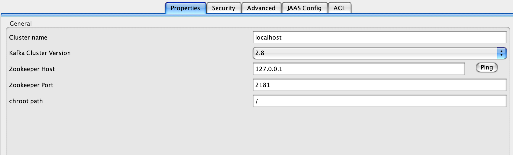
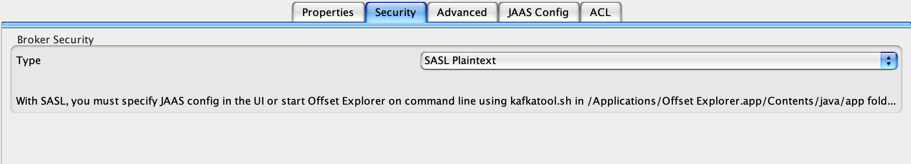
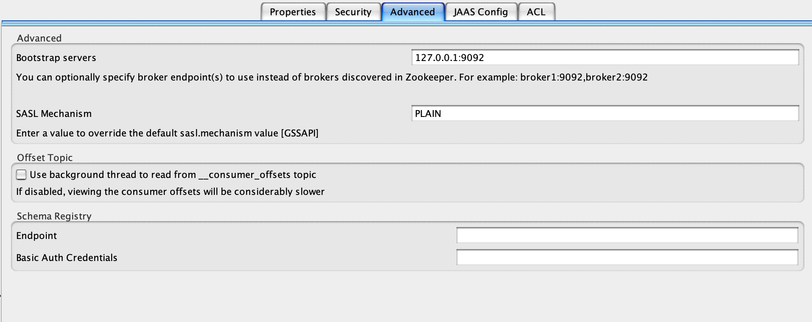
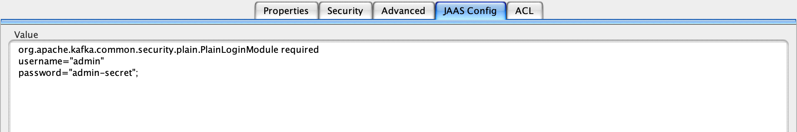

## SpringBoot快速集成Kafka

### 环境
- docker v4.16.2
- springboot 2.7.0
- kafka 2.8.0


- docker-compose启动Kafka

  - 注意其中的配置密码配置
- Kafka版本2.13-2.8.1，采用SASL_PLAINTEXT验证


### 🍚 食用方法
1. 运行[docker-compose.yml](docker%2Fdocker-compose.yml)启动环境
2. 运行[SpringBootKafkaApplication.java](src%2Fmain%2Fjava%2Ftop%2Fsomliy%2Fkafka%2FSpringBootKafkaApplication.java)
3. 运行[SpringBootMqKafkaTest.java](src%2Ftest%2Fjava%2Ftop%2Fsomliy%2Fkafka%2FSpringBootMqKafkaTest.java)往kafka中添加数据
4. 等待日志打印


### 🪛 使用Offset Explorer连接Kafka

#### property填写



#### Security填写



#### Advanced填写



#### JAAS Config填写

分别为用户名，密码（与docker compose中保持一致）

```yml
org.apache.kafka.common.security.plain.PlainLoginModule required username="admin" password="admin-secret";
```

